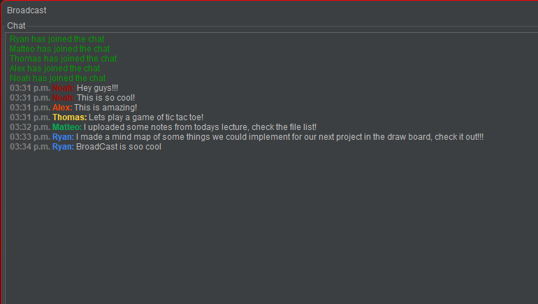
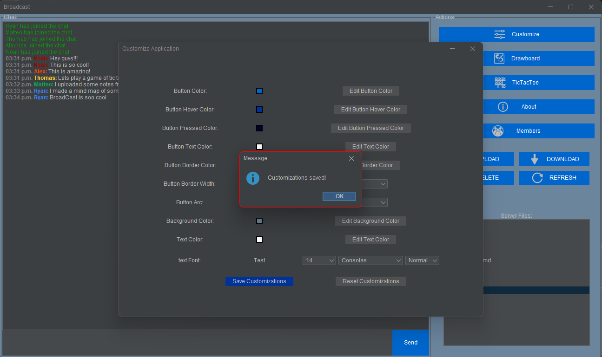
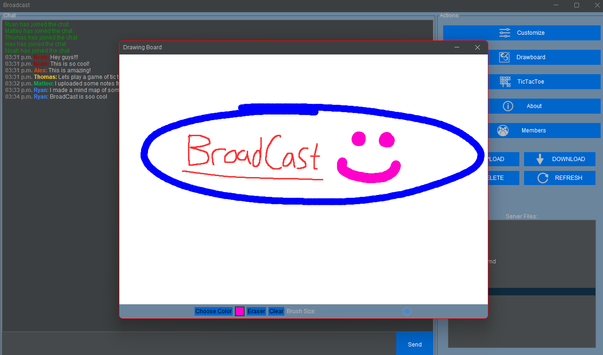
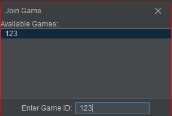
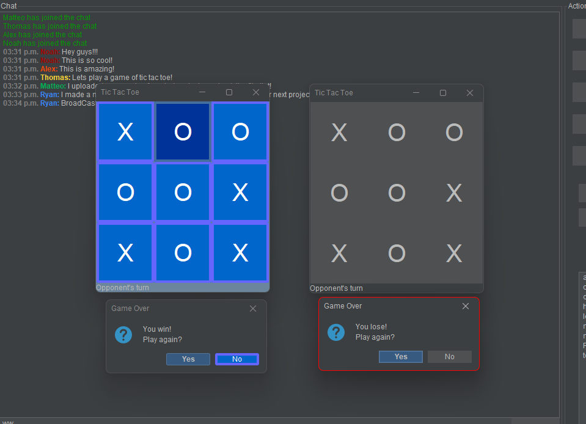
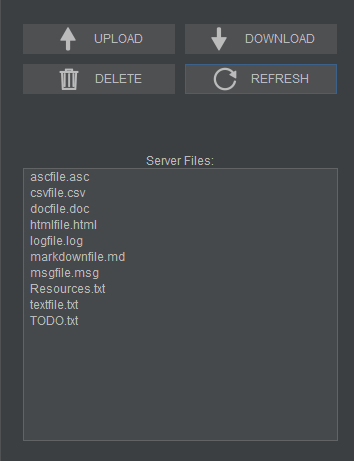

# CSCI2020U Final Course Project - BroadCast

## Table of Contents:
- [Project Info](#project-information)
- [Key Concepts](#key-concepts-used)
- [How to Run](#how-to-run)
- [Demo](#video-demo)
- [Collaborators](#collaborators)
- [Resources](#resources-used)

# Project Information:
### BroadCast, The Ultimate Messaging Application:
*BroadCast* is an extended communications application that removes the limitations of a basic chat application. Within the application there are 5 main core elements.
### 1. The Chat/Main room. In this chat, users can talk to each other within a beautiful UI. Users are notified of any members entering or exiting the chat room, Real time Messaging.

 
* Extra Features: New users joining the chat is displayed in green text, Users leaving are displayed in red text, Messages include Timestamps, Usernames have distinct colors 

### 2. A UI customization page that allows the user to tailor the look and feel of the application to their liking.

 
*Customizable Options: 

Edit Button Color, Edit Button Hover Color, Edit Button Pressed Color, Edit Button Text Color, Edit Button Border Color  
Edit Button Border Width, Edit Button Arc, Edit Background Color, Edit Text Color, Edit Text Font. 

*Note: While some changes may be instant, users should restart their application in order for all changes to be properly applied

*Note: Some Customizations may conflict with the UI, Customize at your own risk

### 3. A synchronized draw-board that tracks user activity and saves it within the server so users can collaboratively illustrate their ideas and/or play games such as hangman, pictionary, etc.

 
*Extra Features: 

Choose Color, Eraser Button, Clear Button, Brush Size Slider

### 4. The fun, classic game of Tic Tac Toe, embedded within BroadCast, allows users to play a game while simultaneously talking in the chatroom.

 

 
*Extra Features: Create games, Join games, 2 Players Required for game

### 5. A file sharing system integrated within BroadCast so users can share text files to all other members of the chatroom.

 
*Extra Features:

Upload, Download, Delete and Refresh files 

# Key Concepts Used:
- Java Swing with FlatLAF UI.
- Server Client connections for all components with multithreading for performance and all other advantages of multithreading.
- Graphics & BufferedImage to draw and save the draw-board.
- File parsing and writing for file transfer.
---

# How to Run:
1. Install Java 23 on your local machine
2. Run `git clone https://github.com/OntarioTech-CS-program/w25-csci2020u-finalproject-w25-team42.git` to clone the repository to your machine.
2. Run the file `RunAllServers.java` located in `src/main/java` to activate all the servers we are using.
   1. note that if the server is not running, functionality for the main application will not work. 
3. Run the file `ChatApplicationMain.java` located in `src/main/java/Chat` to create a client instance.

# Video Demo
*Note: Note that the resolution of the youtube video is significantly lower, whereas the downloadable video is significantly quieter.
A video link, showcasing the entirety of the project:
[Download the video](ReadMeMedia/Demo.mp4)

Access the video on youtube:
[Youtube Video](https://youtu.be/Ix16c4WuySE)

---

# Collaborators:
- Alexis Ryan
- Matteo De Angelis Geraldo
- Noah Robertson
- Ryan Coones
- Thomas Petkovic

# Resources Used
[1]“Measuring Text (The JavaTM Tutorials >        
2D Graphics > Working with Text APIs),” Oracle.com, 2024. Available: https://docs.oracle.com/javase/tutorial/2d/text/measuringtext.html. [Accessed: Apr. 07, 2025]

[2]“SimpleAttributeSet (Java Platform SE 8 ),” Oracle.com, Dec. 04, 2024. Available: https://docs.oracle.com/javase/8/docs/api/javax/swing/text/SimpleAttributeSet.html. [Accessed: Apr. 07, 2025]

[3]“StyleConstants (Java Platform SE 8 ),” Oracle.com, Dec. 04, 2024. Available: https://docs.oracle.com/javase/8/docs/api/javax/swing/text/StyleConstants.html. [Accessed: Apr. 07, 2025]

[4]Oracle, “Java Platform SE 8,” Oracle.com, 2020. Available: https://docs.oracle.com/javase/8/docs/api/

[5]“Serializable (Java Platform SE 8 ),” docs.oracle.com. Available: https://docs.oracle.com/javase/8/docs/api/java/io/Serializable.html

[6]“FlatLaf - Flat Look and Feel | FormDev,” www.formdev.com. Available: https://www.formdev.com/flatlaf/

[7]“BufferedImage (Java Platform SE 8 ),” Oracle.com, Mar. 06, 2019. Available: https://docs.oracle.com/javase/8/docs/api/java/awt/image/BufferedImage.html

[8]“BreakIterator (Java Platform SE 8 ),” Oracle.com, Dec. 04, 2024. Available: https://docs.oracle.com/javase/8/docs/api/java/text/BreakIterator.html. [Accessed: Apr. 07, 2025]
